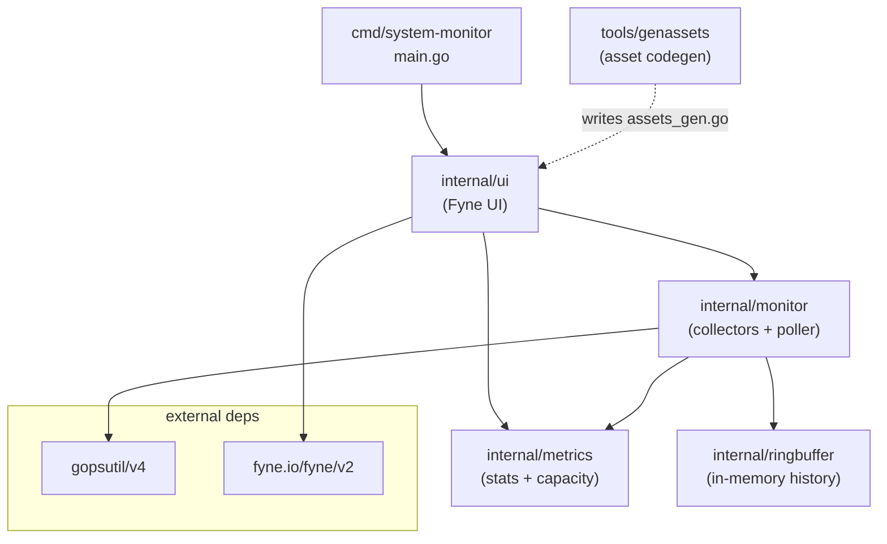
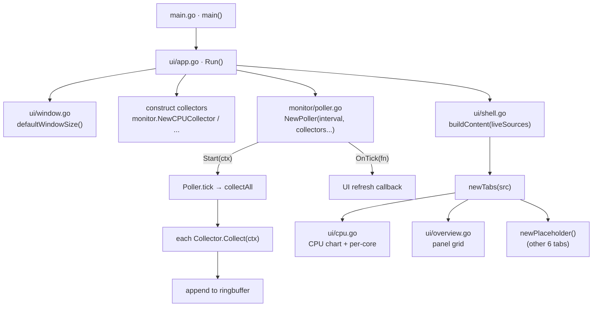
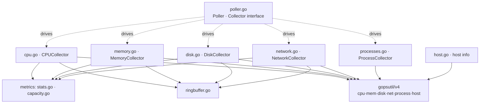
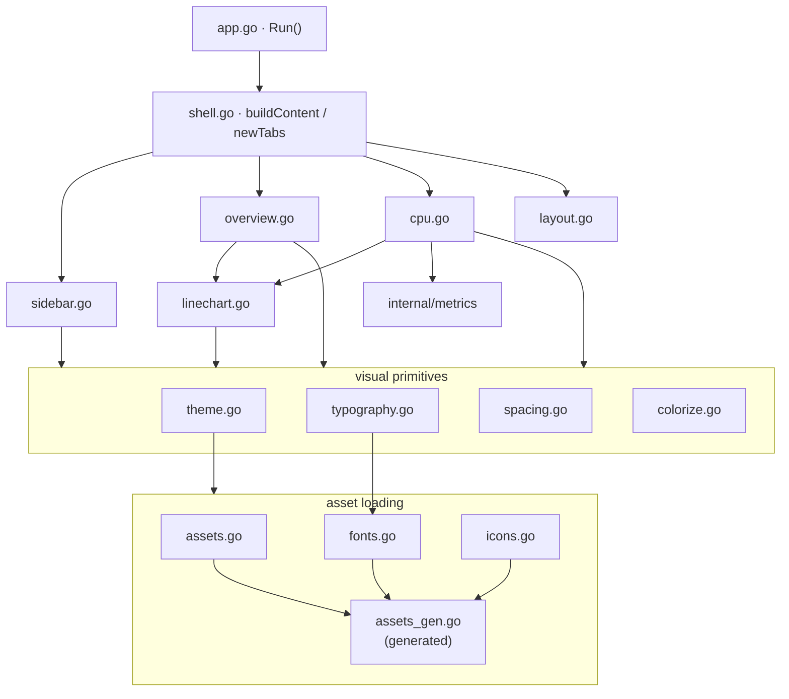
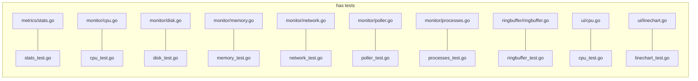
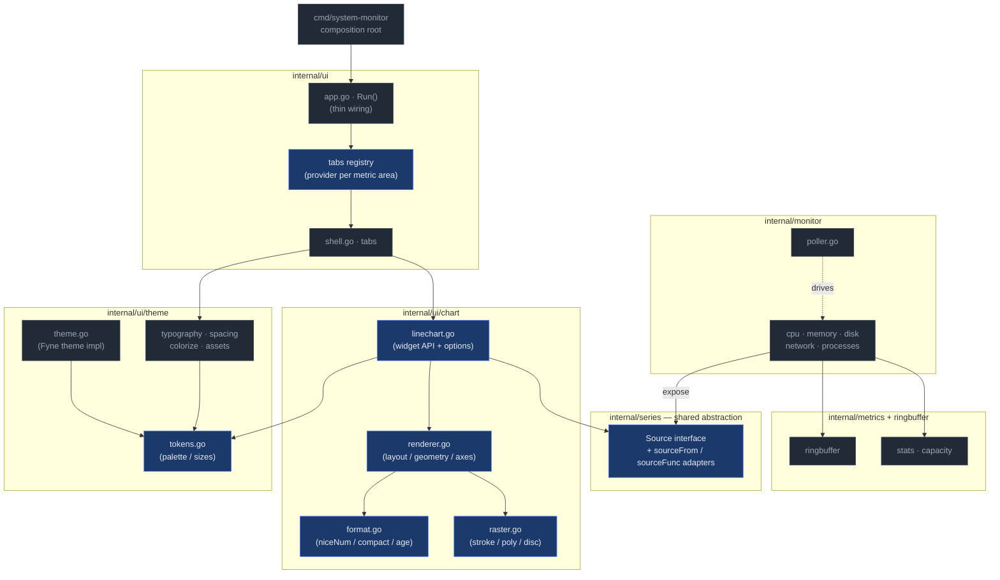

# Code Flowmap — System Monitor

A visual map of the Go source files in this codebase and how they depend on one
another. Generated from the import graph and the orchestration entry points.

Module: `github.com/josephheinz/system-monitor`

---

## 1. Package dependency overview

How the top-level packages relate. Arrows point from dependent → dependency.

---

## 2. Application boot & runtime flow

The runtime wiring: `main` calls `ui.Run`, which builds the collectors, adapts
their histories into chart sources, wires the shell UI, and starts the poller.

---

## 3. internal/monitor — collectors & poller

Each collector implements the `Collector` interface and writes samples into a
ring buffer. Shared math lives in `internal/metrics`.

---

## 4. internal/ui — composition

`shell.go` assembles the chrome (title bar, sidebar, tabs, status bar). Visual
primitives (theme, typography, spacing, colorize) and asset loaders feed the
widgets. `linechart.go` and `cpu.go` render the data-driven views.

---

## 5. Test coverage map

Files with co-located `_test.go` suites.

---

## 6. Recommended modular split (SOLID-aligned)

The diagram below is a **proposal**, not the current state. It targets the
concrete pressure points in today's layout:

- **`linechart.go` (721 lines)** does four unrelated jobs: the public chart
  widget API, the renderer's layout/geometry, low-level vector rasterization
  (`strokePolyline` / `addPoly` / `addDisc` / `signedArea`), and numeric +
  time formatting (`niceNum` / `formatCompact` / `formatAge`). Four reasons to
  change in one file → **SRP** violation.
- **The `Source` interface lives inside `linechart.go`**, yet it is the seam
  between `monitor` (data) and `ui` (rendering). Today `ui` imports `monitor`
  directly and adapts each collector by hand in `Run()`. Pulling the abstraction
  into a neutral package lets both sides depend on it instead of on each
  other → **DIP**.
- **`app.go · Run()` hard-wires every collector→source field manually.** Adding
  a tab means editing `Run`, `liveSources`, and `shell` together → **OCP**
  friction. A small registry/provider seam makes new metric areas additive.

Proposed package boundaries (new/extracted nodes in blue, kept nodes in grey):

### How each move maps to SOLID

| Move | Principle | Payoff |
|------|-----------|--------|
| Split `linechart.go` → `chart/{linechart, renderer, raster, format}.go` | **S**RP | Each file changes for one reason; raster math testable without Fyne. |
| Extract `Source` + adapters into `internal/series` | **D**IP, **I**SP | `monitor` and `ui/chart` both depend on a tiny interface, not on each other. `Source` stays a one-method interface (already ISP-clean). |
| Tab **registry / provider** seam instead of `liveSources` struct edited per tab | **O**CP | New metric area = register a provider; `Run`/`shell` untouched. |
| Collectors expose `Source`s rather than `ui` reaching into histories | **L**SP, **D**IP | Any collector is substitutable behind the same data seam; the existing `Collector` interface already models this on the poll side. |
| Pull color/size **tokens** out of `theme.go` into `theme/tokens.go` | **S**RP | The design-system values (the CLAUDE.md quick-reference table) get one home, consumed by chart + chrome alike. |

**Sequencing note:** the lowest-risk first step is extracting `internal/series`
(pure interface + the two existing adapters move verbatim) since it unblocks the
`ui ↛ monitor` decoupling. The `linechart.go` split is mechanical (functions are
already grouped). The tab registry is the largest change and should come last.

---

_Sections 1–5 reflect the static import graph plus the boot/runtime call flow.
Dotted arrows denote codegen or runtime-driven (not compile-time) relationships.
Section 6 is a forward-looking recommendation, not the current structure._
