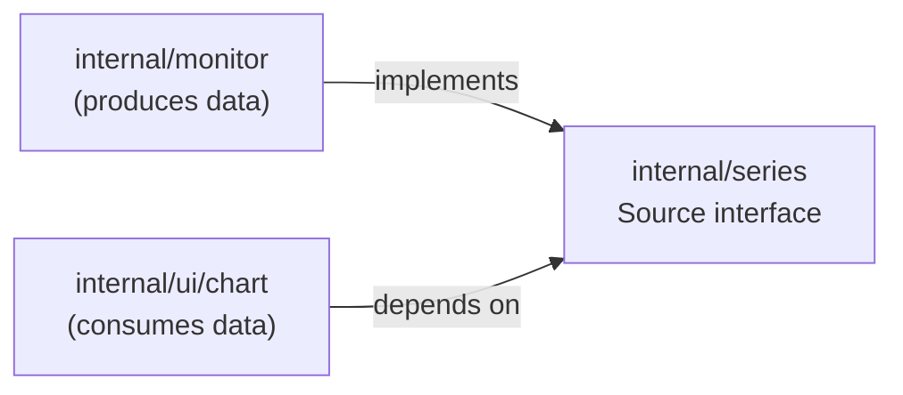

# Standard: Dependency-Inverted Layered Seams

> The codeflow standard. This is the named pattern extracted from the
> **proposed** diagram in [`docs/CODE-FLOWMAP.md` §6](../CODE-FLOWMAP.md).
> Sections 1–5 of that flowmap are today's structure; §6 and this doc are the
> target.

## The pattern, in one paragraph

The app is organized in **layers** — data collection (`internal/monitor`),
storage (`internal/metrics` + `internal/ringbuffer`), and presentation
(`internal/ui`). Layers **never depend on each other directly**. Instead, two
adjacent layers meet at a small, neutral **seam package** that owns the
abstraction between them; both sides depend on the seam, neither depends on the
other. New capability is added by **registering a provider** against a seam, not
by editing the orchestration code that wires everything together. The
composition root (`cmd/system-monitor`) is the one place allowed to know every
concrete type.

That is dependency inversion applied at every layer boundary, plus open-for-
extension registration. Three concrete moves embody it.

## Move 1 — Seam package: `internal/series`

**Problem today.** The `Source` interface lives *inside*
`internal/ui/linechart.go` ([line 68](../../internal/ui/linechart.go)), even
though it is the seam between data and rendering. So `ui` imports `monitor`
directly and hand-adapts each collector in `app.go · Run()`
([`src.cpuOverall = sourceFunc(cpu.Overall)`](../../internal/ui/app.go)). The
arrow points `ui → monitor`: presentation depends on collection.

**Target.** Extract `Source` plus its adapters (`sourceFunc`, `sourceFrom`) into
a neutral `internal/series` package. Then:

```
internal/monitor  ─┐
                   ├─►  internal/series  (Source interface — the seam)
internal/ui/chart ─┘
```

Both sides import `series`; neither imports the other. The dependency arrows now
point **inward, toward the abstraction** — the definition of DIP.



**Why it's first.** It is the lowest-risk move (a pure interface + two existing
adapters move verbatim) and it unblocks the `ui ↛ monitor` decoupling that the
other moves assume. See the sequencing note in flowmap §6.

## Move 2 — Single-responsibility file splits

A seam is only honest if the files on each side change for one reason. The
flagship offender is `internal/ui/linechart.go` (~721 lines), which does four
unrelated jobs:

| Job | Functions today | Target file |
|-----|-----------------|-------------|
| Public widget API + options | `lineChart`, `newLineChart`, `addSeries`, option funcs | `chart/linechart.go` |
| Layout / geometry / axes | `lineChartRenderer`, `arrange`, `layout*`, `seriesPoints` | `chart/renderer.go` |
| Vector rasterization | `strokePolyline`, `addPoly`, `addDisc`, `signedArea` | `chart/raster.go` |
| Numeric + time formatting | `niceNum`, `niceRange`, `formatCompact`, `formatAge` | `chart/format.go` |

The raster and format groups are pure functions with no Fyne dependency —
splitting them out makes them unit-testable in isolation. Same move applies to
pulling design tokens out of `theme.go` into `theme/tokens.go` (see
[no-magic-numbers.md](no-magic-numbers.md) and
[no-string-literals.md](no-string-literals.md), which already treat `palette`
and `sizeName` as the single home for those values).

This is the SRP half of the pattern; see [solid-modularity.md](solid-modularity.md)
for the principle in general.

## Move 3 — Registry / provider extension points

**Problem today.** `app.go · Run()` hard-wires every collector→source field by
hand, and `liveSources` is a struct with one field per metric area. Adding a tab
means editing `Run`, `liveSources`, and `shell` together — the layout is **open
to modification, not extension** (an OCP smell).

**Target.** A tab registry where each metric area registers a provider:

```go
// sketch — a metric area contributes itself; Run/shell stay untouched.
type TabProvider interface {
    Title() string
    Build(series.Registry) fyne.CanvasObject
}

func Register(p TabProvider)        // called from each area's init/setup
func buildTabs(r series.Registry)   // iterates registered providers
```

Adding Memory becomes "register a `memoryTab` provider," not "edit three files."
Because every provider hands back a `Source` through the same seam, any collector
is substitutable behind it (LSP), and the existing `Collector` interface already
models this on the poll side.

**Sequencing:** this is the largest change and comes **last** — after the seam
and the file splits are in place.

## How each move maps to SOLID

| Move | Principle(s) | Payoff |
|------|--------------|--------|
| Extract `Source` + adapters → `internal/series` | DIP, ISP | Tiny one-method interface both sides share; no `ui → monitor` arrow. |
| Split `linechart.go` → `chart/{linechart,renderer,raster,format}.go` | SRP | One reason to change per file; raster/format testable without Fyne. |
| Tab registry / provider seam | OCP, LSP | New metric area = register a provider; `Run`/`shell` untouched. |
| Pull tokens → `theme/tokens.go` | SRP | Design-system values get one home, consumed by chart + chrome. |

## Rules of the pattern (what to do going forward)

1. **No cross-layer imports of concretes.** `ui` must not import `monitor` to
   reach a collector's internals. If you need data in the UI, consume it through
   the seam interface.
2. **Put the abstraction in the neutral package, not the consumer.** An interface
   that two packages share lives in a package that depends on neither — never
   inside one of them.
3. **Extend by registering, not by editing wiring.** When adding a metric area,
   reach for the provider/registry seam. If you find yourself editing `Run()` and
   a central struct to add a feature, that is the OCP smell this pattern removes.
4. **Keep the composition root thin.** `cmd/system-monitor` (and the thin
   `ui.Run`) wires concretes together; everything else depends on abstractions.
5. **Split a file when it has two reasons to change.** Group by reason-to-change,
   not by convenience.

## Checklist

- [ ] Does this change add a cross-layer import of a concrete type? (If yes, route through a seam.)
- [ ] If I added an interface, does it live in a package that neither side has to import the other for?
- [ ] Did I add a feature by editing central wiring instead of registering a provider?
- [ ] Did the file I touched grow a second unrelated reason to change?
- [ ] Are new pure helpers (math/format) separable from Fyne so they can be tested directly?

## Related

- [solid-modularity.md](solid-modularity.md) — the principles this pattern operationalizes.
- [dry.md](dry.md) — the seam is also the single home for the data abstraction.
- [`docs/CODE-FLOWMAP.md`](../CODE-FLOWMAP.md) §6 — the source diagram and sequencing note.
- [`docs/ADR.md`](../ADR.md) — record the seam extraction as an ADR when it lands.
